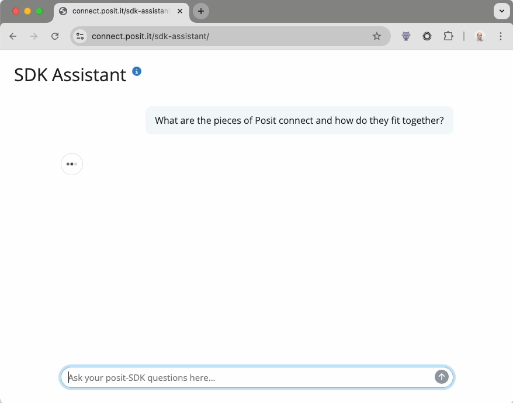
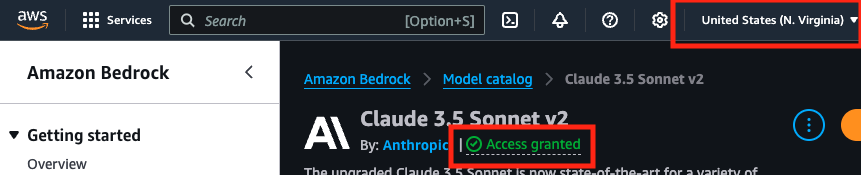

# Posit Connect SDK Assistant



This is a tool to help developers understand how to use the [Posit Connect SDK python package](https://github.com/posit-dev/posit-sdk-py).

Currently, it does not execute any code.

## Usage

To view the live application, visit [this link](https://connect.posit.it/sdk-assistant/).

To run the assistant, simply run the following command:

```bash
make shiny
```

## LLM

The assistant uses AWS Bedrock to run the Anthropic model. The model is a Claude model that is trained on the Posit Connect SDK. The model is trained on the custom prompt and the Posit Connect SDK documentation and function signatures.

**Requirements:**
* Model must be enabled.
  * 
  * You must have access to the model. ("Access Granted" in green in image)
  * The model must be enabled in the region you are running the assistant. This app uses `us-east-1`. ("N. Virginia" in image)
* Model ID must be the "Cross-region Interference" > "Inference profile ID" value. Ex: `"us.anthropic.claude-3-sonnet-20240229-v1:0"`
* For local development, you must be logged into the AWS CLI within your terminal's session.
  * To log into the AWS Browser Console console within the browser, call `aws-console` in a termainal with an active AWS session. Install `aws-console` by running `brew install aws-console`.

## Development

To update the custom prompt, edit the `custom-prompt-instructions.md` file.

To compile the whole prompt, run `make prompt`. This will extract the typings from [posit-sdk](https://github.com/posit-dev/posit-sdk-py), download the latest [Connect swagger json file](https://docs.posit.co/connect/api/swagger.json), and compile the typings/swagger/custom-prompt into a single file: `_prompt.xml`.

`_prompt.xml` is an output file from `repomix`. [Repomix](https://github.com/yamadashy/repomix) outputs the content in XML format which is preferred by the Claude model.


### Future

Possible default prompts:
* [Current default prompt] What are the pieces of Posit connect and how do they fit together?
* Can you create a sequence diagram for the typical workflow?


### Possible TODOs

* Provide common workflow examples for different User types:
  * How to publish content (publisher)
  * How to add a user to a group (admin)

### Deployment

To deploy the assistant, run the following command:

```bash
make deploy
```
