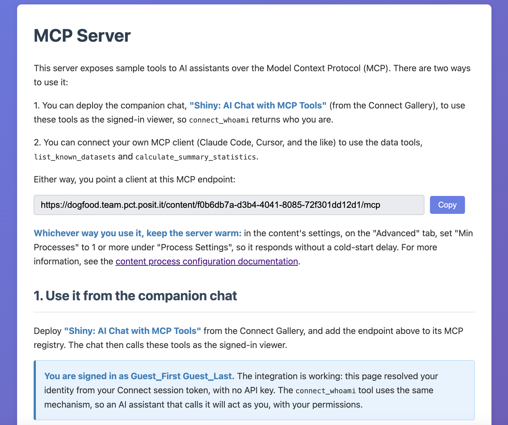

# FastAPI: MCP Server

## About this example

A FastAPI server that exposes tools to AI assistants over the
[Model Context Protocol](https://modelcontextprotocol.io/) (MCP), running on Posit
Connect. It ships three demo tools you can swap for your own: `list_known_datasets`
and `calculate_summary_statistics` (which work over a couple of small built-in
datasets), and `connect_whoami`, which returns the signed-in viewer.

The point it teaches: an MCP tool on Connect can run **as the viewer who calls
it**, using their Connect identity instead of a shared API key. It pairs with the
[Python Shiny: AI Chat with MCP Tools](../simple-shiny-chat-with-mcp/README.md) example,
a chat client that calls these tools, but any MCP client works too.

## How it works

- FastAPI and the [MCP Python SDK](https://github.com/modelcontextprotocol/python-sdk)'s
  `FastMCP` server host the MCP endpoint at `/mcp` (streamable HTTP) alongside a landing
  page at `/`.
- Tools are plain Python functions decorated with `@mcp.tool()`. Their docstrings
  are what the AI reads to decide when to call them.
- `connect_whoami` reads the `Posit-Connect-User-Session-Token` header that Connect
  injects for the logged-in viewer, exchanges it for a viewer-scoped Connect client,
  and calls the `/me` endpoint. So the tool acts as the viewer, with their
  permissions, and no admin API key is involved.
- The landing page demonstrates the same mechanism: it greets you by name, resolved
  from your session token.
- Once a client is connected, the AI calls these tools in conversation. Through the
  paired chat, for example, you might ask "What datasets are available?", "Summarize
  the iris dataset", or "Who am I signed in as?".

## Deploy it

Deploy it straight from the Connect Gallery to get a copy running, then configure
it (below). To run a customized version, get the
[example source](https://github.com/posit-dev/connect-extensions/tree/main/extensions/simple-mcp-server),
make your changes, and publish with
[`rsconnect deploy fastapi`](https://docs.posit.co/rsconnect-python/) or a
[git-backed deployment](https://docs.posit.co/connect/user/git-backed/). Requires
Connect 2025.04.0 or newer with API Publishing and OAuth Integrations enabled.

## Setup

After deploying, configure it for how you'll use it:

- **As the signed-in viewer** (the paired chat, or any Connect content): in the content's
  settings, on the **Access** tab, add a "Connect Visitor API Key" integration under
  **Integrations**. This lets `connect_whoami` identify who's calling. If it isn't
  listed, an administrator must first create a **Connect API** integration on your
  server. See the
  [OAuth Integrations documentation](https://docs.posit.co/connect/user/oauth-integrations/).
- **From your own MCP client** (Claude Code, Cursor, ...): point it at `{content-url}/mcp`
  and authenticate with a Connect API key (`Authorization: Key <API_KEY>`); the landing page
  has copy-paste snippets. `list_known_datasets` and `calculate_summary_statistics` need only
  the API key; `connect_whoami` also requires the "Connect Visitor API Key" integration above,
  and then reports the identity tied to that API key (the per-viewer identity demo is clearest
  from the companion chat).
- **Keep it responsive** (optional): on the **Advanced** tab, set **Min processes** to 1 or
  more under **Process Settings** so the server doesn't cold-start. See the
  [process configuration documentation](https://docs.posit.co/connect/user/content-settings/index.html#process-configurations).

## Customize it

The three tools in `main.py` are demos. Replace them with your own: add a function
decorated with `@mcp.tool()`, give it a clear docstring (the AI uses it to decide when
to call the tool), and return a string. Keep or adapt `connect_whoami` when you want a
tool to act with the caller's Connect identity rather than a shared key.

## Learn more

- [Model Context Protocol](https://modelcontextprotocol.io/)
- [MCP Python SDK](https://github.com/modelcontextprotocol/python-sdk)
- [FastAPI](https://fastapi.tiangolo.com/)
- [Posit Connect OAuth integrations](https://docs.posit.co/connect/user/oauth-integrations/)
- [Python Shiny: AI Chat with MCP Tools](../simple-shiny-chat-with-mcp/README.md), the paired chat client
