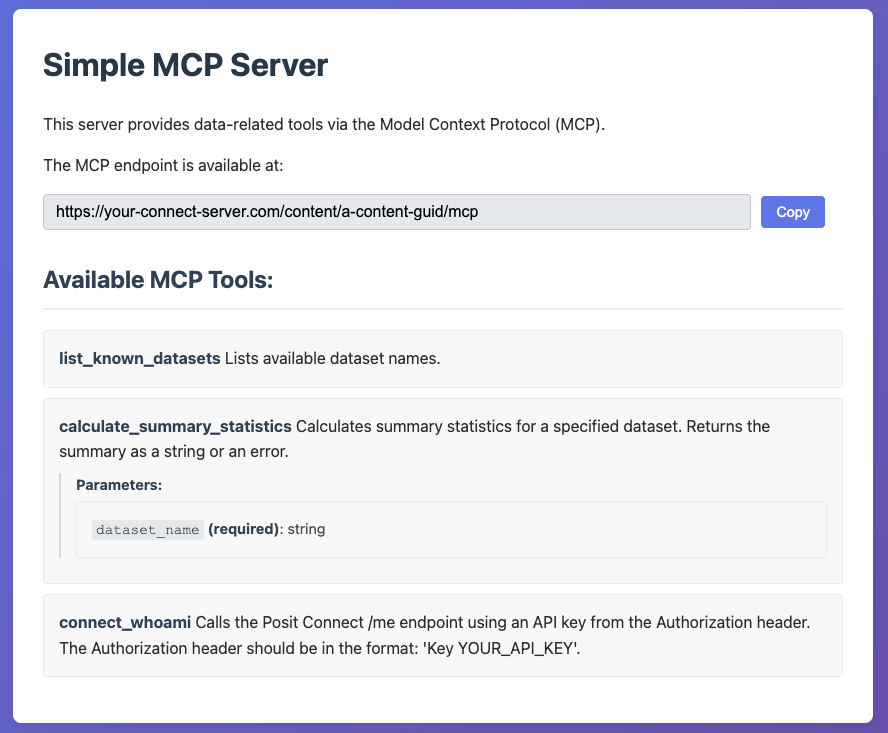

# Simple MCP Server

A FastAPI-based Model Context Protocol (MCP) server that demonstrates how to deploy MCP tools on Posit Connect. This extension showcases Connect's ability to host MCP servers that can be consumed by AI assistants and other MCP clients.

## Overview

This extension demonstrates Connect's capability to host Model Context Protocol servers, enabling LLMs to access and execute tools remotely. The Simple MCP Server provides a collection of data analysis tools and Connect integration capabilities, making it an ideal companion for AI-powered applications like the [Simple Shiny Chat](../simple-shiny-chat-with-mcp/README.md) extension.

## Features

- **FastAPI-Based MCP Server**: Built on FastAPI with streamable HTTP transport for efficient MCP communication
- **Data Analysis Tools**: Includes tools for dataset operations and summary statistics
- **Connect Integration**: Provides tools that interact with Connect's API
- **Interactive Documentation**: Clean web interface that displays available tools and their parameters
- **Copy-to-Clipboard Endpoint**: Easy sharing of MCP server URLs
- **Automatic Tool Discovery**: MCP clients can dynamically discover and use available tools

## Available Tools

### Dataset Operations
- **`list_known_datasets`**: Lists all available datasets in the server
- **`calculate_summary_statistics`**: Generates comprehensive summary statistics for specified datasets

### Connect Integration
- **`connect_whoami`**: Calls the Connect `/me` endpoint using API key authentication

### Sample Datasets
- **Iris Dataset**: Classic machine learning dataset from scikit-learn
- **Sample Data**: Simple demonstration dataset with mixed data types

## Prerequisites

### Connect Requirements

1. **Minimum Connect Version**: 2025.04.0 or later
2. **API Publishing**: Must be enabled on your Connect server
3. **Python 3.10+**: Required for the MCP SDK

## Deployment

### 1. Deploy the Extension
Deploy this extension to your Connect server. If you are deploying through the Connect Gallery, see the [Gallery documentation](https://docs.posit.co/connect/user/publishing-connect-gallery/).

### 2. Access the Server
Once deployed, the extension provides:
- **Web Interface**: Visit the content URL to see available tools and copy the MCP endpoint
- **MCP Endpoint**: Located at `{direct-content-url}/mcp` for MCP client connections

Please note that it is recommended to set the minimum number of instances/processes for this application to >= 1 in the content settings. This will ensure that the MCP server is always available for clients to connect. See the [content process configuration documentation](https://docs.posit.co/connect/user/content-settings/index.html#process-configurations).

### 3. Use with MCP Clients
The server can be consumed by any MCP-compatible client, including:
- [Simple Shiny Chat](../simple-shiny-chat-with-mcp/README.md) extension
- Local MCP clients
- AI development environments that support MCP

## Usage Examples

### With Simple Shiny Chat Extension

1. Deploy both the Simple MCP Server and Simple Shiny Chat extensions
2. In the chat application, add the MCP server URL from this extension
3. Ask the AI assistant to:
   - "What datasets are available?"
   - "Calculate summary statistics for the iris dataset"
   - "Show me information about my Connect user account"

### With Other MCP Clients

Connect to the MCP endpoint at `{your-connect-server}/content/{content-guid}/mcp` and use the available tools programmatically.

If you are not using the Simple Shiny Chat extension to connect to this MCP server, you will need to ensure that you can specify your Connect API key in both the `x-mcp-authorization` header and the `authorization` header for Connect API calls. Some MCP clients may not support that directly today (June 2025).

## Architecture

The application consists of several key components:

- **FastMCP Framework**: Handles MCP protocol implementation and tool registration
- **FastAPI Application**: Provides HTTP transport and web interface
- **Tool Implementations**: Individual functions that implement business logic
- **Template Engine**: Jinja2 templates for the documentation interface
- **Dataset Storage**: In-memory storage for demonstration datasets

## Troubleshooting

### Deployment Issues
- Ensure your Connect server supports API publishing
- Verify Python 3.10+ is available in your Connect environment
- Check that all dependencies are properly installed

### MCP Client Connection Issues
- Verify the MCP endpoint URL is correct (`{content-url}/mcp`)
- Ensure the server is accessible from the client
- Check Connect content permissions

### Tool Execution Errors
- Review tool parameter requirements and types
- Verify API key format for Connect integration tools
- Check Connect logs for detailed error messages

## Integration with Simple Shiny Chat

This MCP server is designed to work seamlessly with the [Simple Shiny Chat](../simple-shiny-chat-with-mcp/README.md) extension:

1. Deploy both extensions to your Connect server
2. Configure the chat application with appropriate LLM credentials
3. Register this MCP server in the chat interface
4. Start conversing with AI assistants that can use these tools

## Related Resources

- [Model Context Protocol Documentation](https://modelcontextprotocol.io/)
- [FastMCP Framework](https://github.com/jlowin/fastmcp)
- [MCP Framework](https://github.com/modelcontextprotocol/python-sdk)
- [FastAPI Documentation](https://fastapi.tiangolo.com/)
- [Simple Shiny Chat Extension](../simple-shiny-chat-with-mcp/README.md)
- [Posit Connect Extension Gallery Guide](https://docs.posit.co/connect/admin/connect-gallery/index.html)

## Support

For issues specific to this extension, please check the [Connect Extensions repository](https://github.com/posit-dev/connect-extensions).
