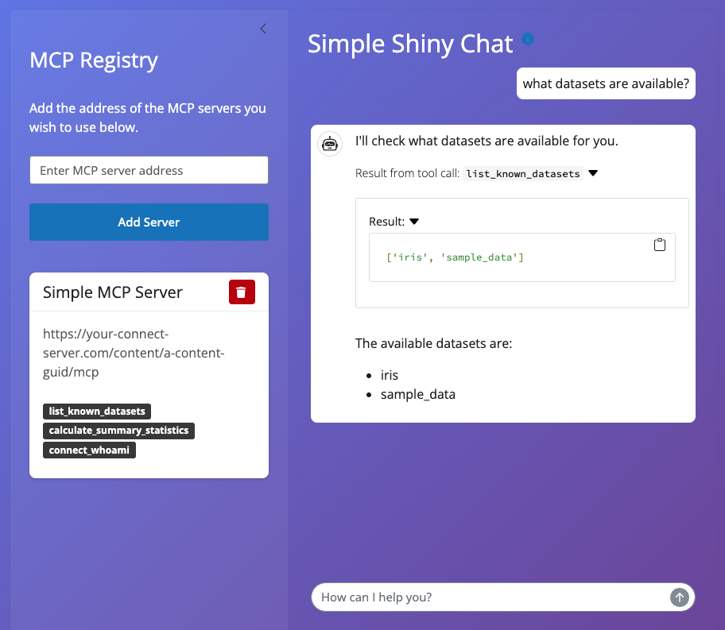

# Simple Shiny Chat

A Shiny chat application that demonstrates how to deploy a Shiny chat application, as well as, utilizing the Model Context Protocol (MCP) to enable LLMs to interact with remote tools and services hosted on Posit Connect and beyond.

## Overview

This extension showcases Connect's ability to take full advantage of the Model Context Protocol, a new standard that enables Large Language Models to run tools hosted in separate processes or servers. The Simple Shiny Chat extension is designed to be paired with MCP servers deployed on Connect, creating a powerful ecosystem where AI assistants can dynamically access and execute tools.



## Features

- **Interactive Chat Interface**: Clean, modern chat UI built with Shiny for Python
- **Dynamic MCP Server Registration**: Add and remove MCP servers on-the-fly through the sidebar
- **Multi-Provider LLM Support**: Compatible with OpenAI, Anthropic/BedrockAnthropic, Google, and other providers via [chatlas](https://posit-dev.github.io/chatlas/)
- **Tool Discovery**: Automatically discovers and displays available tools from registered MCP servers
- **Secure Authentication**: Uses Connect's OAuth integrations and visitor API keys for secure server communication
- **Real-time Streaming**: Supports streaming responses for better user experience

## Prerequisites

### Required Environment Variables

Before deploying this extension, you must configure the following environment variables:

#### LLM Provider Configuration
- `CHATLAS_CHAT_PROVIDER`: The LLM provider to use (e.g., "openai", "anthropic", "google")
- `CHATLAS_CHAT_ARGS`: JSON string with provider-specific arguments (e.g., `{"model": "gpt-4o"}`)

#### API Keys
Set the appropriate API key for your chosen provider:
- `OPENAI_API_KEY`: For OpenAI models
- `ANTHROPIC_API_KEY`: For Anthropic models  
- `GOOGLE_API_KEY`: For Google models

### Connect Requirements

1. **Minimum Connect Version**: 2025.04.0 or later
2. **OAuth Integrations**: Must be enabled on your Connect server
3. **Connect Visitor API Key**: Must be configured in the content access panel

## Setup Examples

### OpenAI Configuration
```bash
CHATLAS_CHAT_PROVIDER="openai"
CHATLAS_CHAT_ARGS='{"model": "gpt-4o"}'
OPENAI_API_KEY="sk-..."
```

### Anthropic Configuration
```bash
CHATLAS_CHAT_PROVIDER="anthropic"
CHATLAS_CHAT_ARGS='{"model": "claude-3-5-sonnet-20241022"}'
ANTHROPIC_API_KEY="sk-ant-..."
```

### Google Configuration
```bash
CHATLAS_CHAT_PROVIDER="google"
CHATLAS_CHAT_ARGS='{"model": "gemini-1.5-pro"}'
GOOGLE_API_KEY="AI..."
```

## Usage

### 1. Deploy the Extension
Deploy this extension to your Connect server with the required environment variables configured. If you are deploying through the Connect gallery, see the documentation detailed [here](https://docs.posit.co/connect/user/publishing-connect-gallery/).

### 2. Configure Access
In the Connect dashboard:
1. Navigate to the content access panel
2. Add a "Connect Visitor API Key" integration
3. This enables the chat application to authenticate with MCP servers

### 3. Register MCP Servers
1. In the chat application sidebar, enter the URL of an MCP server deployed on Connect
2. Click "Add Server" to register it
3. Available tools from the server will be displayed as badges
4. The LLM can now use these tools in conversation

### 4. Start Chatting
Ask the AI assistant to help you with tasks that can be accomplished using the registered MCP tools. The assistant will:
- Show you what tools are available
- Ask for confirmation before executing actions that create, update, or delete data
- Present execution plans for complex multi-step operations
- Display raw tool outputs without modification

## Example MCP Servers

This extension is designed to work with Streamable HTTP MCP servers like this [example](../simple-mcp-server/README.md).

## Architecture

The application consists of several key components:

- **Chat Interface**: Built with Shiny's chat UI components for modern, responsive messaging
- **MCP Client**: Handles registration and communication with MCP servers
- **Authentication Layer**: Manages Connect visitor API keys for secure server access
- **Server Registry**: Dynamic management of registered MCP servers and their tools

## Troubleshooting

### Setup Issues
If you see the setup screen instead of the chat interface:
1. Verify all required environment variables are set
2. Ensure the Connect Visitor API Key integration is properly configured
3. Check that your Connect version meets the minimum requirements

### MCP Server Connection Issues
- Verify the MCP server URL is correct and accessible
- Ensure the server is properly deployed on Connect
- Check that authentication headers are correctly configured

### Chat Response Issues
- Verify your LLM API key is valid and has sufficient credits/quota
- Check the `CHATLAS_CHAT_ARGS` configuration matches your provider's requirements
- Review Connect logs for any authentication or network errors

## Related Resources

- [Model Context Protocol Documentation](https://modelcontextprotocol.io/)
- [chatlas Documentation](https://posit-dev.github.io/chatlas/)
- [Shiny for Python Chat Components](https://shiny.posit.co/py/components/display-messages/chat/)
- [Posit Connect Extension Gallery Guide](https://docs.posit.co/connect/admin/connect-gallery/index.html)

## Support

For issues specific to this extension, please check the [Connect Extensions repository](https://github.com/posit-dev/connect-extensions).

